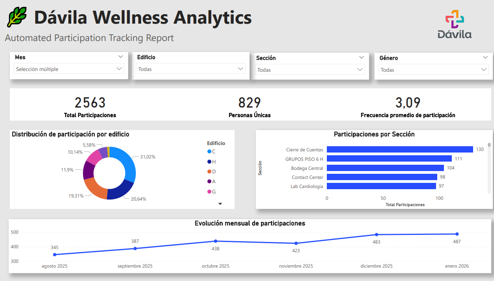
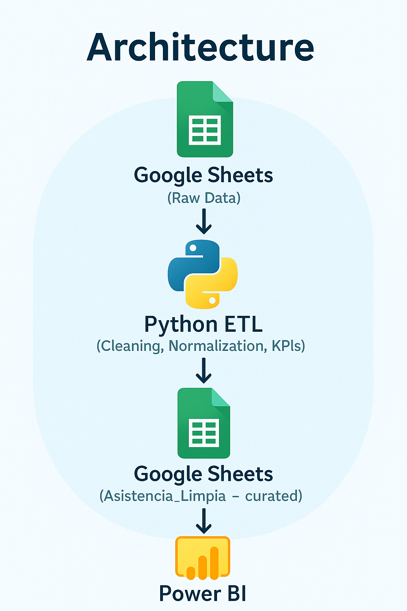
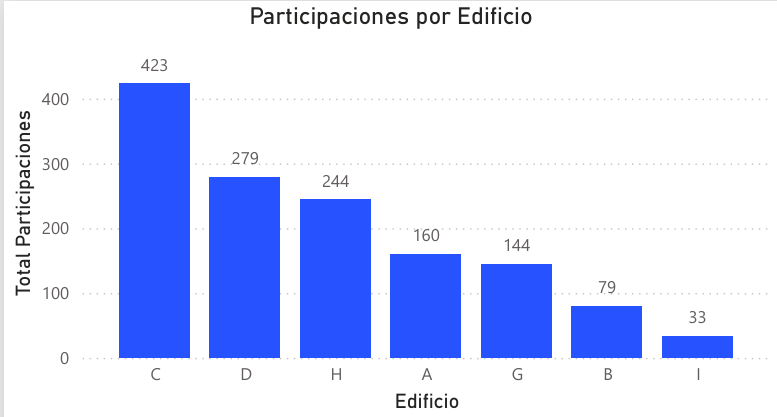
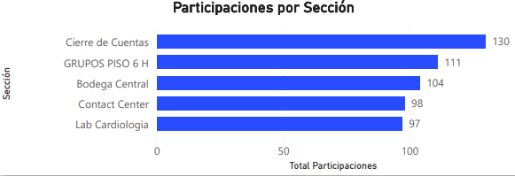
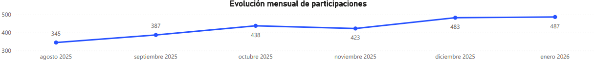

<div align="center">

# **Dávila Wellness Analytics**  
### Automated Data Pipeline & Power BI Executive Dashboard  
*(Google Sheets → Python ETL → Power BI)*  



</div>

---

# 📌 **Overview**

This project automates the entire data workflow behind the **Pausas Laborales (Active Breaks)** program at **Clínica Dávila**, transforming a manual attendance process into a **fully automated analytics system**.

You’ll find:

- 🚀 A Python ETL that cleans, normalizes, deduplicates, and enriches participation data  
- 📊 A Power BI dashboard for decision-making  
- 🔁 A hybrid workflow that feeds clean data back into Google Sheets  
- 📈 KPIs for total participation, building activity, and monthly trends  

---

# 🧩 **Architecture**

<div align="center">
  
</div>

# ⚙️ **Key Features**

### 🧼 **1. Automated ETL Pipeline (Python)**
- Connects to Google Sheets using **Service Account**  
- Normalizes **RUT** formats (Chilean ID)  
- Fixes messy text inputs (names, buildings, sections)  
- Converts date formats  
- Removes duplicates (`rut + fecha`)  
- Generates derived fields (`anio`, `mes`, `dia`)  
- Exports clean data as CSV and JSON  
- Writes curated data back into a new Google Sheets tab: **Asistencia_Limpia**

---

### 📊 **2. Power BI Executive Dashboard**

Includes:

- **KPIs**
  - Total Participaciones  
  - Personas Únicas  

- **Visuals**
  - Participation by Building  
  - Top 10 Sections  
  - Monthly Trend Line  
  - Filter controls: Mes, Edificio, Sección, Género  

- **Design**
  - Custom color palette  
  - Clínica Dávila branding  
  - Clean, minimalist layout  

<div align="center">







</div>

# 🗂️ **Repository Structure**

```markdown
📁 davila-wellness-analytics/
│
├── 📂 src/
│   └── 🐍 pipeline_run.py
│
├── 📂 screenshots/
│   ├── 🖼️ dashboard.png
│   ├── 🖼️ participaciones_edificio.png
│   ├── 🖼️ participaciones_seccion.png
│   └── 🖼️ tendencia_mensual.png
│
├── 📂 report/
│   └── 📄 Davila_Wellness_Analytics.pdf
│
├── 📄 requirements.txt
└── 📄 README.md


# 🧠 **Tech Stack**

| Layer | Technology |
|-------|------------|
| Data Source | Google Sheets |
| ETL | Python, Pandas, Gspread, Google Auth, Dotenv |
| Visualization | Power BI |
| Outputs | CSV, JSON, curated Google Sheet |
| Automation | Windows Task Scheduler (next phase) |

---

# 🏃 **How to Run the ETL**

### 1️⃣ Clone the repo
```bash
git clone https://github.com/YOUR-USER/davila-wellness-analytics

---


